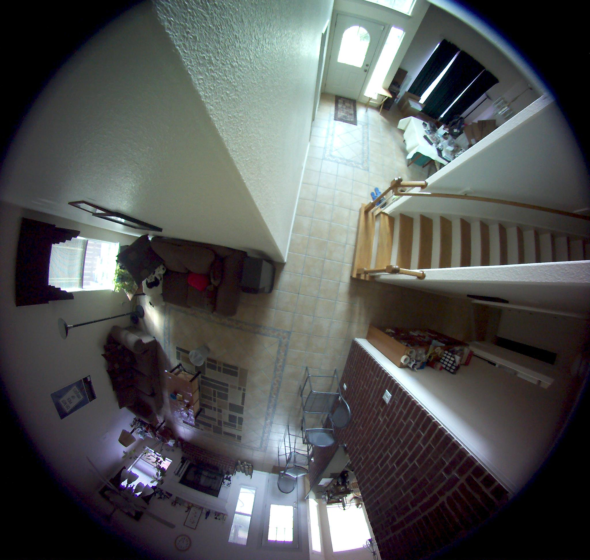
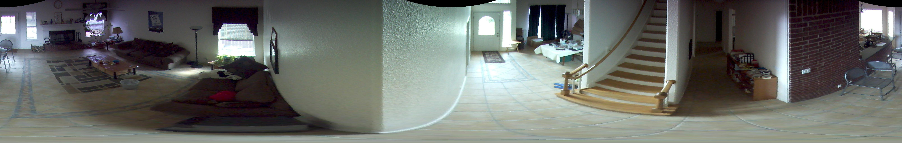

# 🌟 Circular Fisheye to Rectilinear Projection Conversion

This repository provides Python code to convert a circular fisheye image into rectilinear projection. Two versions of the code are available: one using for loops and the other leveraging NumPy's meshgrid for optimized performance.

🙌 The idea for this code has been totally inspired by the amazing work of [bovine/defish](https://github.com/bovine/defish)

## 📋 Prerequisites

* Python 3.x
* Pillow
* NumPy


## 🚀 Usage

To convert a circular fisheye image, follow these steps:

1. Ensure that Python 3.x is installed on your system.

2. Install the required dependencies by running `pip install pillow numpy`.

3. Clone or download the repository to your local machine.

4. Open a terminal or command prompt and navigate to the project directory.

5. Execute the desired version of the code using the following commands:

    * For the for loop version:
        
        ```bash

        python rectify_image_for_loop.py <input_image.jpg> <output_image.jpg>

        ```

    * For the meshgrid version:

        ```bash

        python rectify_image_meshgrid.py <input_image.jpg> <output_image.jpg>

        ```

    Replace `<input_image.jpg>` with the path to your circular fisheye image and `<output_image.jpg>` with the desired path for the rectified image.


## 🌄 Overview

The code takes a circular fisheye image, which is a type of distorted image, and converts it into a rectilinear projection image, which is a straightened version of the original image. 


### 📷 Input

<div align="left">



</div>


### 🖼️ Output

<div align="center">



</div>


___


This conversion is done using some calculations and mapping of pixels between the two image types.

#### 1. Calculating Theta and Mag:

* Theta represents the angle of each pixel in the rectilinear projection image. Think of it as the direction in which each pixel is pointing.
* Mag represents the distance of each pixel from the center of the rectilinear projection image. It determines how far each pixel is from the center.


#### 2. Mapping Target Coordinates:

* For each pixel in the rectilinear projection image, we calculate the corresponding coordinates in the circular fisheye image.
* These coordinates, called `targetx` and `targety`, tell us where each pixel in the rectilinear image should come from in the fisheye image.


#### 3. Handling Invalid Coordinates:

* Sometimes, the target coordinates may be outside the boundaries of the fisheye image. In such cases, there is no corresponding pixel in the fisheye image for the current rectilinear projection pixel.
* In the code, we check if the target coordinates are valid or not. If they are invalid (outside the image boundaries), we set the pixel in the rectilinear image to black.
* This ensures that any pixels in the rectilinear image that do not have a corresponding pixel in the fisheye image are filled with black color.


#### 4. Copying Pixel Values:

* If the target coordinates are valid, it means there is a corresponding pixel in the fisheye image for the current rectilinear projection pixel.
* In this case, we copy the pixel value from the fisheye image to the rectilinear image.
* This step ensures that each pixel in the rectilinear image gets its correct color from the corresponding pixel in the fisheye image.


#### 5. Saving the Rectified Image:

* After all the pixels have been processed, we save the resulting rectilinear projection image to a file.
* The saved image will be a straightened version of the original fisheye image, ready for further analysis or visualization.


___ 


## 📝 Code Explanation

### 🔄 For Loop Version

The code converts the circular fisheye image to rectilinear projection using nested for loops.

1. First, the input image is loaded using the Pillow library's `Image.open()` method, and its dimensions (`width` and `height`) are extracted.

2. Variables for the rectilinear projection are calculated, including the half **height** and **width**, the **maximum distance from the center**, and the **circumference**.

3. An output image is created using Pillow's `Image.new()` method with the appropriate dimensions.

4. Nested for loops are used to iterate over each pixel in the rectilinear projection image.

5. For each pixel, the corresponding theta and mag values are calculated based on the current x and y coordinates using trigonometric formulas.


6. The target coordinates (targety and targetx) are computed using the calculated theta and mag values.

7. If the target coordinates are within the boundaries of the input image, the pixel value from the input image is copied to the corresponding position in the output image.

8. After processing all the pixels, the rectified image is saved as a JPEG file using Pillow's `Image.save()` method.

    The for loop version provides a straightforward implementation but may be slower for large images due to the nested loops.

### 🤔 What's happening inside the for loop?

Inside the for loops, the code iterates over each pixel in the rectilinear projection image and performs the following calculations:

1. **`theta` calculation:**

    * The variable `theta` represents the angle of the current pixel in the rectilinear projection.
    * It is calculated using the formula `-1.0 * x / maxmag`.
    * Here, `x` represents the current x-coordinate within the rectilinear projection, and `maxmag` is the maximum distance from the center to any point in the image.

2. **`mag` calculation:**

    * The variable mag represents the radial distance from the center of the rectilinear projection to the current pixel.
    * It is calculated using the formula `maxmag - y`.
    * Here, y represents the current y-coordinate within the rectilinear projection, and `maxmag` is the maximum distance from the center to any point in the image.

3. **`targetx` and `targety` calculation:**

    * The variables `targetx` and `targety` represent the corresponding coordinates in the circular fisheye image for the current pixel in the rectilinear projection.
    * They are calculated based on `theta`, `mag`, `midx` (half of the image width), and `midy` (half of the image height) using the following formulas:

        ```python
        targety = int(midy + mag * math.cos(theta))
        targetx = int(midx + mag * math.sin(theta))
        ```

**🧐 Now, let's understand what happens within the if-else block:**

The if-else block checks whether the calculated `targetx` and `targety` coordinates are within the boundaries of the input image:

* If the target coordinates are out of bounds (i.e., `targety` is less than 0 or greater than or equal to height, or `targetx` is less than 0 or greater than or equal to width), it means that the current pixel in the rectilinear projection does not correspond to a valid pixel in the circular fisheye image.

* In this case, the if block is executed, and the pixel value in the output image is set to black by using the `output_image.putpixel()` method with `(0, 0, 0)` as the RGB color value.

* If the target coordinates are within the bounds of the input image, it means that the current pixel in the rectilinear projection corresponds to a valid pixel in the circular fisheye image.

* In this case, the else block is executed, and the pixel value from the input image at the `targetx` and `targety` coordinates is copied to the corresponding position in the output image using the `output_image.putpixel()` method.

This if-else block handles the mapping of pixels from the circular fisheye image to the rectilinear projection image. If the target coordinates are valid, the corresponding pixel value is transferred to the output image. Otherwise, black pixels are assigned to the output image for the invalid coordinates.


### 🎲 Meshgrid Version

An alternate way to avoud the computationally expensive for loops is to make use of Numpy's `meshgrid()` function. This version optimizes the code using efficient array operations. Here's an explanation of the code:

1. Just as before, the input image is loaded using Pillow's `Image.open()` method, and its dimensions (**width** and **height**) are extracted.

2. Variables for the rectilinear projection are calculated, including the half **height** and **width**, the **maximum distance from the center**, and the **circumference**.

3. NumPy's meshgrid function is used to create two 2D arrays (`x` and `y`) representing the x and y coordinates of the rectilinear projection. This avoids the need for nested for loops.

4. Array operations are used to efficiently calculate the `theta` and `mag` values for all pixels in the rectilinear projection image.

5. Masks are created to identify invalid target coordinates based on the image boundaries using NumPy's logical operations.

6. The input image is converted to a NumPy array, and an output image array is initialized with zeros.

7. Efficient array indexing is applied to assign the input pixel values to the corresponding output coordinates, excluding the invalid ones. This bulk assignment improves performance compared to individual pixel operations.

8. The rectified image is saved as a JPEG file using Pillow's `Image.save()` method.

    The meshgrid version utilizes NumPy's array operations and efficient indexing to improve runtime performance, especially for large images.


🤗 Feel free to use and adapt either version of the code based on your requirements and the size of your images.


